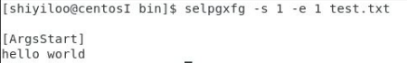
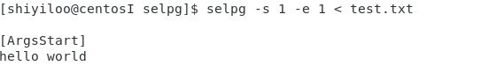
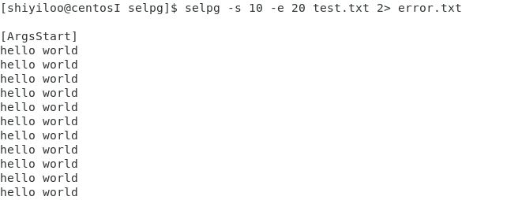

# 概述
  CLI（Command Line Interface）实用程序是Linux下应用开发的基础。正确的编写命令行程序让应用与操作系统融为一体，通过shell或script使得应用获得最大的灵活性与开发效率。Linux提供了cat、ls、copy等命令与操作系统交互；go语言提供一组实用程序完成从编码、编译、库管理、产品发布全过程支持；容器服务如docker、k8s提供了大量实用程序支撑云服务的开发、部署、监控、访问等管理任务；git、npm等都是大家比较熟悉的工具。尽管操作系统与应用系统服务可视化、图形化，但在开发领域，CLI在编程、调试、运维、管理中提供了图形化程序不可替代的灵活性与效率。
  
# 开发实践
1. 请按文档 使用 selpg 章节要求测试你的程序
2. 请使用 pflag 替代 goflag 以满足 Unix 命令行规范， 参考：Golang之使用Flag和Pflag
3. golang 文件读写、读环境变量，请自己查 os 包
4. “-dXXX” 实现，请自己查 os/exec 库，例如案例 Command，管理子进程的标准输入和输出通常使用 io.Pipe，具体案例见 Pipe

# 设计实现

需要实现的命令：

`selpg -s startPage -e endPage [-l linePerPage | -f ][-d dest] filename`


参数解析：

-s：开始打印的页码（必填）

-e：结束打印的页码（必填）

-l：表示按固定行数打印文件

-f：表示按照换页符来打印

-d：打印的目的地址，默认为屏幕。

<br>

定义存储参数的结构体 `selpgArgs`

```go
type selpgArgs struct {
	startPage  int
	endPage    int
	inFileName string
	printDest  string
	pageLen    int
	pageType   bool
}
``` 

<br>

函数 `getArgs()` 使用 `pflag` 包中的函数对从命令行输入的参数做处理和解析

```go
func getArgs(args *selpgArgs) {
	flag.IntVarP(&(args.startPage), "startPage", "s", -1, "start page")
	flag.IntVarP(&(args.endPage), "endPage", "e", -1, "end page")
	flag.IntVarP(&(args.pageLen), "pageLength", "l", 1, "page length")
	flag.StringVarP(&(args.printDest), "printDest", "d", "", "print dest")
	flag.BoolVarP(&(args.pageType), "pageType", "f", false, "page type")
	flag.Parse()

	argLeft := flag.Args()
	if len(argLeft) > 0 {
		args.inFileName = string(argLeft[0])
	} else {
		args.inFileName = ""
	}
}
``` 

<br>

在获取参数后需要使用 checkArg 函数对参数的正确性做检查
包括：
* 第一个参数必须为's'
* 开始页码必须大于等于1，且小于计算机能表示的最大整数值
* 第二个参数必须为'e'
* 结束页码必须大于等于开始页码，且小于计算机能表示的最大整数值
* 页长度必须大于等于1，且小于计算机能表示的最大整数值
* 检查是否还有剩余的参数用作输入文件名

```go

func checkArgs(sa *selpgArgs) {
	if len(os.Args) < 3 {
		fmt.Fprintf(os.Stderr, "\n%s: not enough arguments\n", progname)
		flag.Usage()
		os.Exit(1)
	}

	if os.Args[1] != "-s" {
		fmt.Fprintf(os.Stderr, "\n%s: 1st arg should be -s startPage\n", progname)
		flag.Usage()
		os.Exit(2)

	}

	INT_MAX := 1<<32 - 1

	if sa.startPage < 1 || sa.startPage > INT_MAX {
		fmt.Fprintf(os.Stderr, "\n%s: invalid start page %s\n", progname, os.Args[2])
		flag.Usage()
		os.Exit(3)

	}

	if os.Args[3] != "-e" {
		fmt.Fprintf(os.Stderr, "\n%s: 2nd arg should be -e end_page\n", progname)
		flag.Usage()
		os.Exit(4)
	}

	if sa.endPage < sa.startPage || sa.endPage > INT_MAX {
		fmt.Fprintf(os.Stderr, "\n%s: invalid end page %d\n", progname, sa.endPage)
		flag.Usage()
		os.Exit(5)
	}
func checkInputFile(filename string) {
	_, errFileExits := os.Stat(filename)
	if os.IsNotExist(errFileExits) {
		fmt.Fprintf(os.Stderr, "\n[Error]: the input file \"%s\" does not exist\n", filename)
		os.Exit(8)
	}
}
	if sa.pageLen < 1 || sa.pageLen > (INT_MAX-1) {
		fmt.Fprintf(os.Stderr, "\n%s: invalid page length %d\n", progname, sa.pageLen)
		flag.Usage()
		os.Exit(6)
	}

	if len(flag.Args()) == 1 {
		_, err := os.Stat(flag.Args()[0])
		if err != nil && os.IsNotExist(err) {
			fmt.Fprintf(os.Stderr, "\n%s: input file \"%s\" does not exist\n", progname, flag.Args()[0])
			os.Exit(7)
		}
		sa.inFileName = flag.Args()[0]
	}

	fmt.Printf("\n[ArgsStart]\n")
}

``` 
<br>

函数`excute()`对输入的指令进行执行，这一步发生在对`getArgs()`的调用之后
函数需要实现的功能为：
* 检查是否有输入文件
* 检查是否有输出地址
* 将内容从输入文件/标准输入打印到输出文件/标准输出
```go
func excute(sa *selpgArgs) {
	var fin *os.File
	if sa.inFileName == "" {
		fin = os.Stdin
	} else {
		checkInputFile(sa.inFileName)
		var err error
		fin, err = os.Open(sa.inFileName)
		execError(err, "encounter an error when open input file")
	}

	if len(sa.printDest) == 0 {
		printToDes(os.Stdout, fin, sa.startPage, sa.endPage, sa.pageLen, sa.pageType)
	} else {
		printToDes(createPipe(sa.printDest), fin, sa.startPage, sa.endPage, sa.pageLen, sa.pageType)
 	}
}
``` 

<br>

函数 `printToDes`按照要求将输入打印到输出，包括：
* 判断页的划分依据（f/n）
* 从buff中读取需要的页数
* 判断页数是否满足要求
* 在页数超出（start，end）范围时输出错误
* 页数符合要求时将输出送到目标地址

``` go
func printToDes(fout interface{}, fin *os.File, pageStart int, pageEnd int, pageLen int, pageType bool) {
	lineCount := 0
	finalPage := 1
	buf := bufio.NewReader(fin)
	for true {
		var line string
		var err error
		if pageType {
			line, err = buf.ReadString('\f')
			finalPage++
		} else {
			line, err = buf.ReadString('\n')
			lineCount++
			if lineCount > pageLen {
				finalPage++
				lineCount = 1
			}
		}

		if err == io.EOF {
			break
		}

		execError(err, "encounter an error when read in file")

		if (finalPage >= pageStart) && (finalPage <= pageEnd) {
			var outputErr error
			if stdOutput, ok := fout.(*os.File); ok {
				_, outputErr = fmt.Fprintf(stdOutput, "%s", line)
			} else if pipeOutput, ok := fout.(io.WriteCloser); ok {
				_, outputErr = pipeOutput.Write([]byte(line))
			} else {
				fmt.Fprintf(os.Stderr, "\n[Error]:fout type error. ")
				os.Exit(8)
			}
			execError(outputErr, "Error happend when output the pages.")
		}
	}

	if finalPage < pageStart {
		fmt.Fprintf(os.Stderr, "\n[Error]: startPage (%d) greater than total pages (%d), no output written\n", pageStart, finalPage)
		os.Exit(11)
	} else if finalPage < pageEnd {
		fmt.Fprintf(os.Stderr, "\n[Error]: endPage (%d) greater than total pages (%d), less output than expected\n", pageEnd, finalPage)
		os.Exit(12)
	}
}
```
	
<br>

其余函数

* 函数 `execError`进行错误的检查与类型输出

* 函数 `checkInputFile`对输入文件的正确性做检查，如果该文件不存在则打印错误并返回

* 函数 `createPipe` 将命令行的输入管道cmd.StdinPipe()获取的指针赋值给fout，然后将fout返回给printToDes作为输出位置


# 测试结果

1. `selpg -s10 -e20 input_file`




2. `selpg -s10 -e20 < input_file`



3. `other_command | selpg -s10 -e20`


4. `selpg -s10 -e20 input_file >output_file`


5. `selpg -s10 -e20 input_file 2>error_file`



6. `selpg -s10 -e20 input_file >output_file 2>error_file`


7. `selpg -s10 -e20 input_file >output_file 2>/dev/null`


8. `selpg -s10 -e20 input_file >/dev/null`


9. `selpg -s10 -e20 input_file | other_command`


10. `selpg -s10 -e20 input_file 2>error_file | other_command`


11. `selpg -s10 -e20 -l66 input_file`


12. `selpg -s10 -e20 -f input_file`


