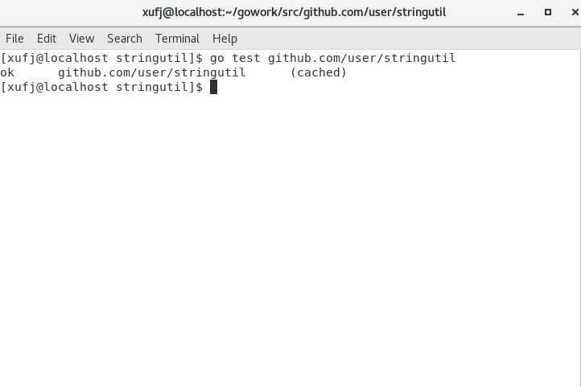

# 使用 GO 开发第一个包
## 一、选择包路径
按照文档说明，我的第一个包放在 `$ mkdir $GOPATH/src/github.com/user/hello` 下
在该目录中通过 `vim hello.go` 指令创建第一个文件
添加代码如下：
```go
package main

import "fmt"

func main() {
	fmt.Printf("Hello, world.\n")
}
```
在该文件夹中通过 `go install` 安装
此命令构建了 `hello` 命令，产生一个可执行的二进制文件安装到工作空间的 bin 目录中。 在我的电脑上为 `$GOPATH/bin/hello`
进入到该文件夹下执行程序：


## 二、编写第一个库
类似的，在 `$GOPATH/src/github.com/user/stringutil` 创建新的包目录
创建文件 `vim reverse.go`
文件内容如下：
```go
// stringutil 包含有用于处理字符串的工具函数。
package stringutil

// Reverse 将其实参字符串以符文为单位左右反转。
func Reverse(s string) string {
	r := []rune(s)
	for i, j := 0, len(r)-1; i < len(r)/2; i, j = i+1, j-1 {
		r[i], r[j] = r[j], r[i]
	}
	return string(r)
}
```
之后通过 `$ go build` 命令进行构建。

接着修改 hello.go 文件内容：
```go
package main

import (
	"fmt"

	"github.com/user/stringutil"
)

func main() {
	fmt.Printf(stringutil.Reverse("!oG ,olleH"))
}
```
在hello 的文件夹下使用 $ go install 命令。这样他所依赖的 stringutil 包也会被自动安装。
运行此程序的新版本，此时看到了反向信息：


## 三、测试
创建文件 $GOPATH/src/github.com/user/stringutil/reverse_test.go 来为 stringutil 添加测试
```go
package stringutil

import "testing"

func TestReverse(t *testing.T) {
	cases := []struct {
		in, want string
	}{
		{"Hello, world", "dlrow ,olleH"},
		{"Hello, 世界", "界世 ,olleH"},
		{"", ""},
	}
	for _, c := range cases {
		got := Reverse(c.in)
		if got != c.want {
			t.Errorf("Reverse(%q) == %q, want %q", c.in, got, c.want)
		}
	}
}
```
使用 go test 运行该测试


